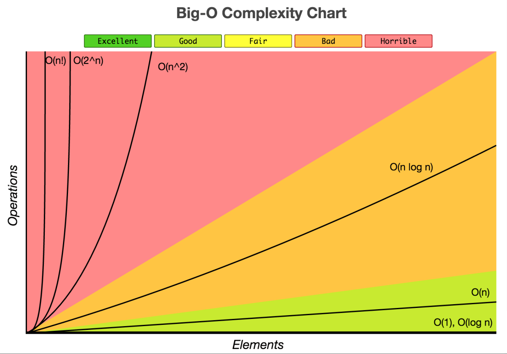

 

# Data Structures And Algorithms

Data Structures and algorithms is the important part of computer programming.Because it help to write best and efficent code. In this repository learn about Data Structure and algorithms.


### Index

- [Inroduction of DSA](#Inroduction_of_DSA)
  - [Algorthims](#algorithm)
  - [Data Structures](#Data_Structure)
- [Complaxity](#complaxity)
  - [Time Complaxity](#Time_Complaxity)
  - [Space Complaxity](#Space_Complaxity)
  - [Big O](#Big_O)
    - [O(1)](<#O(1)>)
    - [O(log n)](<#O(log_n)>)
    - [O(n)](<#O(n)>)
    - [O(nlog n)](<#O(nlog_n)>)
    - [O(n^2)](<#O(n^2)>)
    - [O(2^n)](<#O(2^n)>)
    - [O(n!)](<#O(n!)>)

# Introduction_of_DSA

Let's got to introduce data structures and algorithms.

## Algorithm

**_What is Algorithms ?_**
In computer programming terms, an algorithms is a set of well-defined instruction to solve a particular problem. It take a set of input and produces a desired output.

**_For example :_**
An algorithms add two numbers :

1. Take two numbers inputs
2. Add numbers using the input + operator
3. Display the result

**_Qualities of good Algorithms_**

1. Input and output defined precisely
2. Each Step in the algorithms should be clear.
3. Algorithms should be effective among many different ways to solve a problem.
4. An algorithms should not include computer code. Instead algorithms should be written in such a way that it can be used in different programming language.

# Data_Structure

**_What are Data Structures ?_**

Data structures is a storage that is use to store and organize data. It is way arranging data on a computer so that it can be accessed and updated efficiently.

**_Type of Data structure :_**
Basically, data structures are divided into two categories :

1. Linear Data structure
2. Non-linear Data structure

### Linear Data structures

In linear data structures, the elements are arranged in squence one after the other. Since elements are arranged particular order, they are easy to implement.

However, when the complexity of the program increase, the linear data
structues might not be the best choose because of operational complexities.

**_Example of linear data structures :_**

1. Array
2. Stack
3. Queue
4. Linked List

### Non Linear Data structures :

Unlike linear data structures, elements in not-learner data structures are not in any sequence. Instead they are arranged in a hierarchical manner where one element will be connected to one or more elements.

Non-linear data structures are further divided into graph and tree based data
structures.

1. Graph Data Structures
2. Trees Data Structures

## Why learn DSA ?

- for make code scalable
- for increase problem solving sill
- for better in programming competition
- for be good software engineer
- for learn about Artificial Intelligence

# Complaxity

Sometimes, there are more than one way to solve a problem. We need to learn how to compare the performance different algorithms and choose the best one to solve a particular problem. While analyzing an algorithm, we mostly consider time complexity and space complexity. Time complexity of an algorithm quantifies the amount of time taken by an algorithm to run as a function of the length of the input. Similarly, Space complexity of an algorithm quantifies the amount of space or memory taken by an algorithm to run as a function of the length of the input.

## Time_Complaxity

Time complexity of an algorithm quanifies to run as a function of the length of the input.

## Space_Complaxity

Space complexity of an algorithm quantifies the amount of space or memory taken by an algorithm to run as a function of the length of the input.

## Big_O


We can not measurement time and space in secound and byte of computer program. Because this things varies on computer to computer.

**_Try to measure program execute time:_**

```c
#include <stdio.h>
#include <time.h>

int main(void){
    // calculate program run time
    clock_t start_time,end_time;
    double total_time;
    start_time = clock();

    int a,b;
    a = 20;
    b = 30;
    printf("a + b : %d\n",a+b);

    end_time = clock();
    total_time = end_time - start_time;

    printf("\n>>>> This program Taken : %lf millisecound\n",total_time);
    printf("--\n-\n>>>> Finish Program <<<<\n");
}
```

**_First Time Output :_**

```
a + b : 50

>>>> This program Taken : 73.000000 millisecound
--
-
>>>> Finish Program <<<<
```

**_Secound Time Output :_**

```
a + b : 50

>>>> This program Taken : 80.000000 millisecound
--
-
>>>> Finish Program <<<<
```

We see that first time program take 73 millisecound and secound time it take 80 millisecound to solve same problem. It's mean how many time program take it defend on machine. That's why we can not calculate program time complexity with millisecound

In space complaxity int type data take 4 byte of memory. But some c compailer int take 8 byte of memory. Not only that. Some programming language do not have int type variable. So We can not measurement space in byte.

**_Three way to measurement time and space complexity :_**

1. Big O (O)
2. Theta (θ)
3. Omega (Ω)

**_In this case we learn about Big O complexity :_**
Example of sum of two number :

```c
#include <stdio.h>

int main(void){
    int number_one,number_two,result; // --> o(1)


    /**
     * total space complexity
     * number_one --> o(1)
     * number_two --> o(2)
     * result --> o(3)
     *
     * it's mean space complexity is constant.
     * so call that o(1) or order of 1
     *
     * */

    number_one = 10; // --> o(2)
    number_two = 40; // --> o(3)
    result = number_one + number_two; // --> o(4)

    printf("result %d\n",result); // --> o(5)

    return 0; // --> o(6)
}
```

In this program total execute 6 instruction. so we said it O(6) or Order of 6. But simplify this thing to O(1). Because the execuation syntax is constant. and space complexity is o(1);

So this program Time complexity is O(1) and space complexity is O(1)

**_Total 7 type of big o notation :_**

1. O(1)
1. O(log n)
1. O(n)
1. O(nlog n)
1. O(n^2)
1. O(2^n)
1. O(n!)

**_Big O graph :_**


### O(1)

O(1) means time coplexity can not defined on input. It constant all time.

**_Example :_**

```c
#include <stdio.h>

// function prototype
int sum(void);

int main(void){
    return 0;
}

int sum(void){
    int number_one,number_two,result; // --> o(1)


    /**
     * total space complexity
     * number_one --> o(1)
     * number_two --> o(2)
     * result --> o(3)
     *
     * it's mean space complexity is constant.
     * so call that o(1) or order of 1
     *
     * */

    number_one = 10; // --> o(1)
    number_two = 40; // --> o(1)
    result = number_one + number_two; // --> o(1)

    printf("result %d\n",result); // --> o(1)

    return 0; // --> o(1)
}

/**
 * time complexity
 * T(x) = 1 + 1 + 1 + 1 + 1 + 1
 * T(x) = 6
 * T(x) = O(6)
 * T(x) = O(1)
 *
 * time complexity is  O(1)
 *
 * */

```

    O(1) Mean Constant Time

### O(n)

O(n) means time complexity defined on input. It execute time is n th time.

**_Example :_**

```c
#include <stdio.h>

// function prototype
int sum(int);

int main(void){
    return 0;
}

int sum(int n){
    int sum,i; // --> O(1)

    /**
     * space complexity for this program :
     * sum --> O(1)
     * i --> O(1)
     * n --> O(1)
     *
     * S(x) = 1 + 1 + 1
     * S(x) = 3
     * S(x) = O(3)
     * S(x) = O(1)
     *
     * space complexity is O(1)
     *
     * */

    sum = 0; // --> O(1)

    for(i = 1; i <= n;i++){// --> O(n+1)
        sum += i; // --> O(n)
    }


    return sum; // --> O(1)
}

/**
 * time complexity for this program
 * t(x) = 1 + 1 + (n+1) + n + 1
 * t(x) = 4+2n
 * t(x) = 2n + 4
 * t(x) = O(2n + 4)
 * t(x) = O(n)
 *
 * */
```

2n + 4 in here n is biggest. so we remove all number expcept n. Then time complexity is O(n)

    O(n) mean Linear Time

### O(n^2)

**_Example :_**

```c
#include <stdio.h>

// function prototype
int sum(int size,int [size][size]);

int main(void){
    return 0;
}

// sum function
int sum(int size,int array[size][size]){
    int row,col,sum; // --> O(1)

    /**
     * total space complecity
     * size --> O(1)
     * array --> O(n*n)
     * row --> O(1)
     * col --> O(1)
     * sum --> O(1)
     *
     * calculate space complexity
     * S(x) = 1 + n*n + 1 + 1 + 1
     * S(x) = 4 + n^2
     * S(x) = O(n^2+4)
     * S(x) = O(n^2)
     *
     * */

    sum = 0; // --> O(1)
    for(row = 0; row < size;row++){ // --> O(n+1)
        for(col = 0; col < size;col++){ // --> O(n*(n+1))
            sum = sum + array[row][col]; // --> O(n*n)
        }
    }

    return sum; // --> O(n)
}

/**
 * calculate time complexity
 * T(x) = 1 + 1 + (n+1) + n*(n+1) + n*n + 1
 * T(x) = 4 + n + n^2 + n + n^2
 * T(x) = 2n^2 + 2n + 4
 * T(x) = O(2n^2 + 2n + 4)
 * T(x) = O(n^2)
 *
 * total time complexity is
 * O(n^2)
 *
 * */
```

**_Let's see the another example :_**

```c
// function sum_two
int sum_two(int size,int array[size][size][size]){
    int t,row,col,sum; // --> O(1)

    /**
     * calculate space complaxity
     * size --> O(1)
     * array --> O(n*n*n)
     * t --> O(1)
     * row --> O(1)
     * col --> O(1)
     * sum --> O(1)
     *
     * S(x) = 1 + (n*n*n) + 1 + 1 + 1 + 1
     * S(x) = n^3 + 5
     * S(x) = O(n^3 + 5)
     * S(x) = O(n^3)
     *
     * space complaxity is O(n^3)
     *
     * */

    sum = 0; // --> O(1)
    for(t = 0; t < size;t++){ // --> O(n+1)
        for(row = 0; row < size;row++){ // --> O(n*(n+1))
            for(col = 0;col < size;col++){ // --> O(n*n*(n+1))
                sum+= array[t][row][col]; // --> O(n*n*n)
            }
        }
    }

    return sum; // O(1)
}

/**
 * calculate total time complexity
 * T(x) = 1 + 1 + (n + 1) + (n* (n + 1)) + (n*n*(n+1)) + (n*n*n) + 1
 * T(x) = 4 + n + n^2 + n + n^3 + n^2 + n^3
 * T(x) = 2n^3 + 2n^2 + 2n + 4
 * T(x) = O(2n^3 + 2n^2 + 2n + 4)
 * T(x) = O(n^3)
 *
 * time complexity O(n^3)
 *
 * */
```

    O(n^2) mean Quadratic Time
